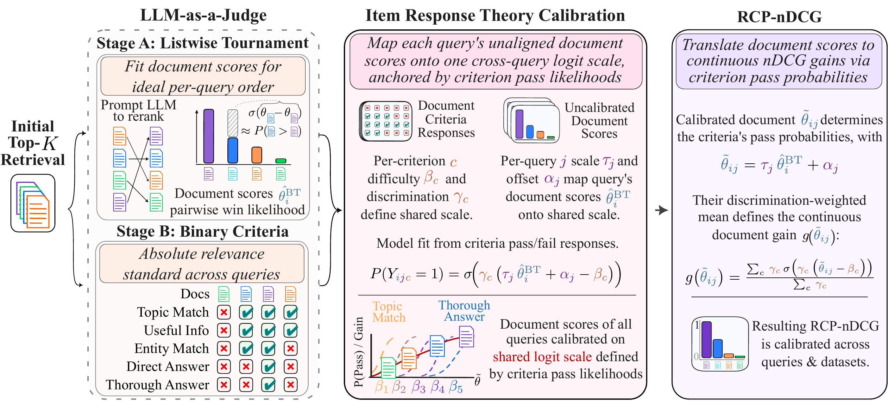

<p align="center">
  <picture>
    <source media="(prefers-color-scheme: dark)" srcset="docs/assets/cohere-logo-dark.svg">
    
  </picture>
</p>

# RCP-nDCG

RCP-nDCG is nDCG whose gains come from calibrated LLM judgements instead of sparse human relevance labels. An LLM
judge orders each query's candidate pool in a listwise tournament and answers five binary rubric criteria for every
document; a two-parameter item-response model then puts the tournament scores of all queries on one scale, and a
document's gain is its discrimination-weighted probability of passing the criteria. The method and its validation
are in the paper
[Rubric-Calibrated Preferences: Cross-Query Calibration of LLM Judgments via Item Response Theory](https://arxiv.org/abs/2609.35739).

<p align="center">
  
</p>
<p align="center"><em>The RCP-nDCG pipeline (Figure 2 of the paper).</em></p>

This repository holds the library and command line (`rcp-ndcg`), the scripts that reproduce the paper's tables from
the public data (`experiments/`), and runnable examples (`examples/`).

## Install

RCP-nDCG needs Python 3.12 or later, and is on PyPI:

```bash
pip install "rcp-ndcg[hf,calibrate]" --extra-index-url https://download.pytorch.org/whl/cpu
rcp-ndcg --version
```

or, without installing anything, `uvx rcp-ndcg --version`. `rcp-ndcg-core`, which comes with it, is the metric, the
gains, the scoring protocols and the IRT estimators, with numpy and pydantic only (`pip install rcp-ndcg-core`).
The extras add the Hugging Face Hub (`hf`), torch for the calibration fit (`calibrate`; the CPU build from the
PyTorch index above is enough), MTEB (`mteb`) and local GPU retrieval and reranking (`local`). From a checkout of
the repository, `uv sync --extra hf --extra calibrate` sets up the same environment. A command that needs a missing
extra exits with code 10 and prints the install line.

## Datasets

All data behind the paper is public on the Hugging Face Hub:

| Dataset | Contents |
|---|---|
| [rcp-ndcg-nanobeir](https://huggingface.co/datasets/fabianschmidt-cohere/rcp-ndcg-nanobeir) | 13 NanoBEIR tasks with calibrated RCP gains; runs with stock `mteb` ≥ 2.0.1 (`ndcg_float_at_10`) |
| [rcp-ndcg-bright](https://huggingface.co/datasets/fabianschmidt-cohere/rcp-ndcg-bright) | 12 BRIGHT tasks with calibrated RCP gains; stock `mteb` ≥ 2.0.1 |
| [rcp-ndcg-vidore-v3](https://huggingface.co/datasets/fabianschmidt-cohere/rcp-ndcg-vidore-v3) | 8 ViDoRe v3 visual-document tasks (6 languages) with calibrated RCP gains; stock `mteb` ≥ 2.10.5 |
| [rcp-ndcg-trecdl](https://huggingface.co/datasets/fabianschmidt-cohere/rcp-ndcg-trecdl) | TREC-DL 2019 and 2020 with continuous RCP gains next to the NIST judgements; stock `mteb` ≥ 2.0.1 |
| [rcp-ndcg-external-validation](https://huggingface.co/datasets/fabianschmidt-cohere/rcp-ndcg-external-validation) | The human contest study (46 annotators, 311 contests, 7,080 grades) and the external LLM judges (GLM-5.3-flash, DeepSeek-4.1-flash, Kimi-K3) |

`experiments/fetch_data.py` downloads all five at the pinned revisions used for the paper's tables.
[docs/data.md](docs/data.md) describes their layout and how to load them. Each dataset card states its license.

## Three ways in

### 1. Score a system on the released data, without an LLM

The released datasets carry a calibrated gain for every judged pool document, so scoring a ranking needs no judge.
Put your system's scores in a file with query ids, document ids and scores (Parquet, CSV, a TREC run or JSONL) and
score it against a suite with the paper's scoring protocol. The subsets of a suite share query ids, so a file that
ranks several subsets names each row's subset in a `dataset` column ([data](docs/data.md)):

```bash
rcp-ndcg eval score --rankings my_system.parquet --suite nanobeir
```

[`examples/01_score_released_suite.py`](examples/01_score_released_suite.py) scores the paper's 14 rerankers on a
NanoBEIR task from their released runs:

<!-- snippet: example examples/01_score_released_suite.py -->
```python
import rcp_ndcg as rcp

REPO = "fabianschmidt-cohere/rcp-ndcg-nanobeir"
TASK = "NanoFiQA2018Retrieval"

dataset = rcp.load_dataset(f"hf://{REPO}/{TASK}")  # qrels with gains, judged pools, excluded ids; protocol nanobeir
rankings = rcp.load_rankings(f"hf://datasets/{REPO}/provenance/runs/{TASK}.parquet")
rerankers = [s for s in rankings.systems if "judge" not in s]  # the file also holds the judge's own orders

report = rcp.evaluate(rankings, dataset=dataset, k=10, bootstrap=0)
print(f"{TASK} under the {dataset.protocol} protocol")
print(f"{'reranker':42s} {'RCP-nDCG@10':>12s} {'qrel-nDCG@10':>13s}")
for system in sorted(rerankers, key=lambda s: -report.value(s, "rcp_ndcg")):
    print(f"{system:42s} {report.value(system, 'rcp_ndcg'):12.4f} {report.value(system, 'qrel_ndcg'):13.4f}")
```

[`examples/02_score_tiny_offline.py`](examples/02_score_tiny_offline.py) does the same offline, on a three-query
dataset that ships with the package (`rcp-ndcg data fetch --dataset tiny --out tiny` copies it).

### 2. Re-judge a pool with your own endpoint

Serve a judge behind any OpenAI-compatible endpoint (vLLM, SGLang, a hosted API). Estimate the calls and tokens,
then run:

```bash
rcp-ndcg run start rejudge_nfcorpus --judge-url http://localhost:8000/v1 --judge-model my-model --estimate
rcp-ndcg run start rejudge_nfcorpus --judge-url http://localhost:8000/v1 --judge-model my-model
```

The run judges the released NanoNFCorpus pools on both stages, fits the calibration and scores the pools, and
writes every artifact to `runs/<run_id>/`. For long passes, add `--mirror <any fsspec URI>` (S3, GCS, Azure, or
your own backend) so a preempted job resumes where it stopped; see
[durability](docs/concepts/serving.md#durability-local-runs-and-a-mirror).
[Serving](docs/concepts/serving.md) gives the vLLM and SGLang commands for each shipped judge, and a run config's
`serve:` section starts the engine inside a SLURM or Kubernetes job. To rehearse offline, the same pipeline runs
with a deterministic fake judge:

```bash
rcp-ndcg run start tiny
```

[Calibrate your benchmark](docs/tutorials/calibrate-your-benchmark.md) walks through a run on your own data, and
[primitives](docs/concepts/primitives.md) shows how to re-judge some documents, insert new ones, or pool a second
judge without refitting a published calibration (examples 04 to 06).

### 3. Reproduce a table of the paper

```bash
pip install -r experiments/requirements.txt
python experiments/fetch_data.py                 # the public datasets, at pinned revisions (about 150 MB)
python experiments/run_all.py                    # every check; exits 1 if a value falls outside its tolerance
```

The scripts recompute the NanoBEIR, BRIGHT, ViDoRe v3 and TREC-DL leaderboards, the human contest study and the
external-judge comparisons from the released data, and print each paper value next to the reproduced one.
[REPRODUCIBILITY.md](REPRODUCIBILITY.md) and [experiments/README.md](experiments/README.md) say what is covered.

## MTEB

The released datasets run with stock [mteb](https://github.com/embeddings-benchmark/mteb) through the
`rcp_ndcg_tasks.py` each dataset ships, and through `rcp_ndcg.eval.mteb.get_tasks` (the `mteb` extra). Each task
reports `ndcg_float_at_k`, nDCG over the continuous RCP gains with group-mean ties. An integration into mteb itself
is proposed in [embeddings-benchmark/mteb#5516](https://github.com/embeddings-benchmark/mteb/pull/5516). See
[`examples/07_mteb.py`](examples/07_mteb.py) and [the MTEB page](docs/tutorials/mteb-integration.md).

## Documentation

- [docs/](docs/index.md): the metric, the scoring protocols, the tournament, the rubric, the calibration, the
  primitives, preprocessing, and serving and runners, one page each; the data; tutorials; the command line.
- [examples/](examples/): seven short scripts, five of which run offline.
- [skills/rcp-ndcg/SKILL.md](skills/rcp-ndcg/SKILL.md): instructions for a coding agent that uses RCP-nDCG from
  another project. Every command except `mcp serve` takes `--json`; `rcp-ndcg schema show commands` describes the
  command line, and `rcp-ndcg mcp serve` exposes it as MCP tools.
- [AGENTS.md](AGENTS.md): for contributors to this repository. [CHANGELOG.md](CHANGELOG.md): the public surface.

## Citation

If you use RCP-nDCG, please cite the paper. [CITATION.cff](CITATION.cff) holds the reference, and GitHub's "Cite
this repository" turns it into BibTeX.

## License

Apache-2.0, see [LICENSE](LICENSE). Copyright 2026 Cohere Inc. The datasets carry their own licenses on the Hub.
